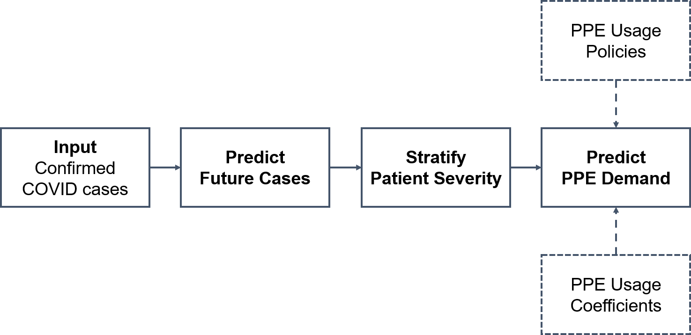

### Estimating COVID-19 Hospital Demand for PPE

This model was developed to perform short-term predictions of future demand for personal protective equipment (PPE) needed by healthcare and other essential workers when in contact with COVID-19 patients. Model predictions are driven by the confirmed number of COVID-19 cases within a specified location.

As seen below in the process diagram, the model is comprised of three modules including: prediction of COVID-19 cases, stratification of COVID-19 patients by severity, and prediction of PPE demand. Prediction of COVID-19 cases was achieved by curve fitting to historical data using a weighted average between an exponential, quadratic, and logistic function. These mathematical functions are widely used to capture the different dynamics and phases in a disease outbreak. Stratification of COVID-19 patients was done by specifying the expected proportion of patients to not require critical care, to require critical care, and finally to require critical care and mechanical ventilation. It is assumed that the patient would remain at the hospital for different lengths of time (3-14 days) based on their symptom severity. Prediction of PPE demand is then finally calculated based on the number of COVID-19 patients and specified coefficients representing the average PPE used per patient. Users can select between “Normal” (i.e., PPE replaced for each patient interaction) and “Constrained” (i.e., PPE use extended to conserve inventory) use models. Model Parameters were selected based on literature, consultation with subject matter experts, published guidelines from Centers for Disease Control and Prevention, and from empirical data.
 

The model is intended for short-term forecasting PPE demand over a period 3 weeks. While predictions can be made for longer-term demand, there is a low level of confidence in the results. This limitation is due to the use of curve fitting to predict COVID-19 cases, which is well-suited for near-term but not long-term predictions.

### Estimating Other Demand Sources for PPE
PPE demand was also estimated for non-COVID hospital usage such as police, firefighters, emergency medical technicians (EMT), long term care facilities, and home health care. Demand estimates for these sources were calculated based on the total number of employees in each respective industry and their anticipated weekly PPE usage per employee. The number of employees in a given county or state was estimated based on the 2019 occupational employment statistics from the U.S. Bureau of Labor Statistics.

### Estimating Hospital Demand for Pharmaceuticals
A surge in COVID-19 patients has led to an increase in demand for drugs commonly used in the ICU and commonly used during mechanical ventilation. To identify and prevent potential future drug shortages, this model provides the estimated demand for the use of drugs at hospitals to treat COVID-19 patients and for the use of drugs at hospitals for general, non-COVID-19 use. This model was developed by analyzing electronic health records at health systems comprised of nearly 16,000 hospital beds dispersed throughout the United States from a one-month time period prior to the start of the COVID-19 pandemic and then for six-weeks during the largest peak of COVID-19 cases in the United States.   From this analysis, estimates were developed for the average drug dosage per COVID-19 patient and the average non-COVID usage per staffed hospital bed.

### Surge Scenario Planning 
The purpose of this tool is to assist decision makers in planning for a potential surge in COVID-19 cases by forecasting cumulative case counts over a 4-month window at different severity levels (mild, moderate, severe, and very severe). Surge scenarios were created using a SEIR model, a widely used compartmental model in epidemiology that involves a patient population transitioning through the following compartments: susceptible, exposed, infected, and death or recovered. Additional information on SEIR models can be found [here](https://en.wikipedia.org/wiki/Compartmental_models_in_epidemiology). Parameters for the SEIR model were found by fitting the model to historical COVID-19 cumulative case counts and deaths for each county and state. Counties are then grouped together based on their 2013 NCHS Urban and Rural Code under the assumption that a surge within a metropolitan area would likely be different compared to one in a rural area. For each urban and rural code group, counties are ranked and ordered based on their historical surge severity. Surges for different scenarios are then generated based on the fitted model parameters of counties as following: mild (21-40 percentile), moderate (41-60 percentile), severe (61-80 percentile), and very severe (81-100 percentile). Upper and lower bounds for each scenario are also calculated by increasing/decreasing the SEIR model infection rate parameter by 5%.

### Acknowledgements
This model and dashboard were developed as a collaboration effort between Mitre, Cardinal Health, Llamasoft, LogicStream Health, Sodexo Healthcare Services, and GHX.

### Data Sources
* [USA Facts - Cumulative COVID-19 cases](https://usafacts.org/visualizations/coronavirus-covid-19-spread-map/)
* [Definitive Healthcare - U.S. Hospital Beds](https://aws.amazon.com/marketplace/pp/USA-Hospital-Beds-COVID-19-Definitive-Healthcare/prodview-yivxd2owkloha#overview)
* [BLS - U.S. Occupational Employment Statistics](https://www.bls.gov/oes/#data)
* [2013 NCHS Urban-Rural Classification](https://www.cdc.gov/nchs/data_access/urban_rural.htm)
